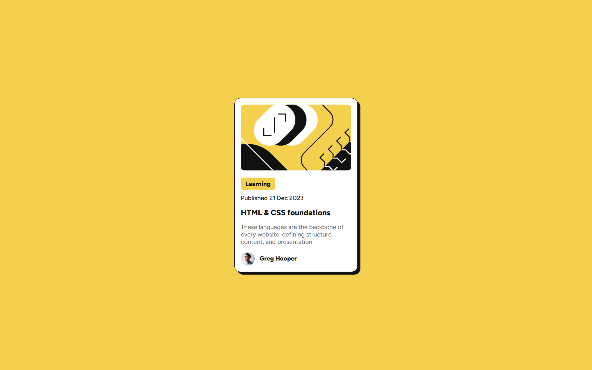

# 🌟 Frontend HTML & CSS Foundations Card Project 🚀

Welcome to the **HTML & CSS Foundations Card Project**! 🎉 This is a sleek, modern, and visually appealing card component built with pure HTML and CSS. It’s designed to showcase a blog post preview with a vibrant, eye-catching design that screams creativity and simplicity. Whether you're a beginner learning the ropes or a seasoned coder looking for inspiration, this project is your playground! 🛠️

---

## 🎯 What's This Project About?

This project is a stylish **blog card** that highlights the essentials of HTML and CSS. It’s a single, responsive card featuring:
- A bold image header 📸
- A vibrant category label 🏷️
- A publication date 📅
- A catchy title and description ✍️
- An author section with a cool avatar 🧑‍💻

The card is wrapped in a sunny yellow background, with a clean white card, subtle shadows, and rounded corners to give it that modern, professional vibe. It’s perfect for learning how to structure content with HTML and style it with CSS! 💻

---

## 🔗 Live Site

Check out the live demo of this awesome card here:  
🌐 [**View the Blog Card Live!**](https://example.com/blog-card)  

> *Note: Replace the above link with the actual hosted URL if deployed!*

---

## 🛠️ Tech Stack

- **HTML**: For structuring the card's content with semantic elements. 📝
- **CSS**: For styling with flexbox, custom fonts, and HSL colors to make it pop! 🎨
- **Font**: Uses the trendy **Figtree** font from Google Fonts for that modern aesthetic. 🖌️

---

## 🚀 Features That Make It Shine

- **Responsive Design**: The card adapts beautifully to different screen sizes. 📱💻
- **Box Shadow Magic**: A subtle shadow gives the card a 3D effect. 🌟
- **Hover-Friendly**: Ready for you to add hover effects if you want to spice it up! ✨
- **Clean Code**: Well-organized HTML and CSS for easy reading and modification. ✅

---

## 🖼️ Sneak Peek

Imagine a sleek white card with a bold image, a bright yellow label screaming "Learning," and a clean layout that makes you want to dive into web development! Here’s what it looks like:

  

---

## ⚙️ How to Run This Project

1. **Clone or Download**: Grab the project files from the repository. 🗂️
2. **Open `index.html`**: Just double-click `index.html` to view it in your browser. No server needed! 🌐
3. **Tweak the Code**: Open the files in your favorite code editor (VS Code, anyone? 😎) and start experimenting!
4. **Add Your Flair**: Customize the colors, fonts, or even add animations to make it your own. 🎨

---

## 🎨 Customization Ideas

Want to make this card your own? Here are some fun ideas:
- 🌈 Change the background color to a gradient for a bolder look.
- 🖼️ Swap the placeholder image with your own blog post thumbnail.
- ✨ Add hover effects like scaling or color changes to the card.
- 📱 Optimize it further for mobile with media queries.
- 🎥 Add a subtle animation to the card’s shadow for extra flair!

---

## 🙌 Contributing

Got ideas to make this card even cooler? Fork the repo, make your changes, and send a pull request! Let’s build something amazing together. 🤝

---

## 🌟 Acknowledgments

- Inspired by the awesome web dev community! 🙌
- Thanks to **Figtree** font for making text look snazzy. 🖌️
- Built with 💖 by [Nisarg Vekariya](https://github.com/nisargvekariya01)

Let’s keep coding, keep creating, and keep shining! ✨
